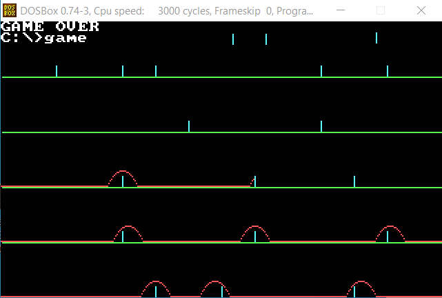
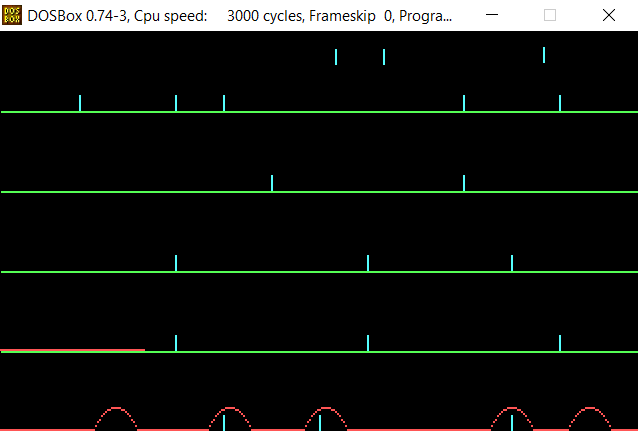

# Assembly jumper game

First year university assignment for Computer architecture course (second assignment)

# How to play?

Press SPACE to jump over obstacles and make it to the upper most layer!





# Okay but how do you actually run .asm file? :D

Step 1: Buy an ancient old Intel 8088 microprocessor.

jk :D

1. Setup DosBox with TASM [tutorial here](https://shreyasjejurkar.com/2017/03/27/how-to-install-and-configure-tasm-on-windows-7810/)

Yeah, just simply follow the tutorial above. The only thing is - copy not only game.asm file to TASM directory, but also do copy game_map.txt file. And yeah, program name is "game".

The same tutorial in short:

1. Install DosBox
2. Download and unzip TASM program files. Move folder to C disk root dir.
3. Mount C disk:

   1. Open "DOSBox 0.74-3 Options.bat" in DosBox program files directory (possibly in C:\Program Files (x86)\DOSBox-0.74-3\ )
   2. Add these lines at the very end of opened text file:

   ```
   mount c c://tasm
   c://
   ```

   3. Copy game.asm and game_map.txt files to to a very leaf (if there's multiple TASM directories) directory of TASM.
   4. Open DosBox and run these lines:

   ```
   tasm game.asm
   tlink game
   game
   ```

   > :warning: **If you unzipped TASM which has another TASM directory**: cd your way to the very leaf TASM directory with your game.asm and game_map.txt files 5.

   5. When replaying it is enough to run:

   ```
   game
   ```

   or don't even type the text. Just hit the "up" arrow. And then enter.

   6. Good luck playing! A legend says that no one got to the end of the game...

## For developers

They say only legends code with assembly. So I wish you a lot of strength :)
